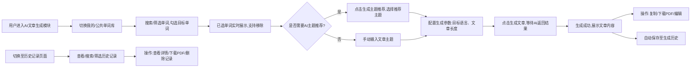

# AI文章生成模块需求规格说明书
## 一、文档概述
### 1.1 文档目的
本文档完整定义AI文章生成模块的产品需求、业务规则、功能边界、技术约束与验收标准，作为该模块前后端开发、测试、上线验收的唯一依据，确保模块功能符合用户预期，无缝集成至现有SpringBoot + Vue前后端分离项目。

### 1.2 适用范围
- 业务范围：用户单词库对接、AI主题推荐、多语言文章生成、文章结果操作、生成历史管理、PDF导出全流程功能；
- 系统范围：现有SpringBoot后端服务、Vue前端管理/用户端系统；
- 读者范围：产品经理、前后端开发工程师、测试工程师、运维工程师。

### 1.3 术语说明
| 术语 | 说明 |
|------|------|
| 我的单词库 | 用户自主上传、管理的个人专属单词集合，仅当前用户可见可用 |
| 公共词库 | 系统预置、全用户共享的公开单词集合，所有用户均可查看选用 |
| AI主题推荐 | 基于用户选中的单词，通过大语言模型生成匹配的文章创作主题 |
| 多语言生成 | 支持基于选中单词，生成指定语种的文章内容 |
| 生成历史 | 用户过往所有文章生成操作的记录，包含文章内容、生成参数、时间等信息 |

### 1.4 需求优先级
| 优先级 | 定义 | 包含功能 |
|--------|------|----------|
| P0（核心必做） | 模块核心流程必须实现的功能，无此功能模块不可用 | 单词选择、AI主题推荐、多语言文章生成、文章复制、历史记录查看 |
| P1（高优） | 提升用户体验、满足核心诉求的必备功能 | PDF导出、历史记录管理、异常场景处理 |
| P2（中优） | 可后续迭代优化的扩展功能 | 文章在线编辑、批量生成、收藏功能 |

## 二、项目背景与业务目标
### 2.1 项目背景
现有系统已具备用户单词上传、公共词库管理的基础能力，用户存在基于指定单词进行多语言文章创作的核心诉求，需通过AI能力降低用户创作门槛，实现「单词选择→主题推荐→文章生成→内容导出」的全链路闭环，提升系统核心价值与用户留存。

### 2.2 业务目标
1. 核心能力：实现基于用户自选单词的AI多语言文章生成，覆盖主流语种，满足不同场景创作需求；
2. 体验提升：通过AI主题推荐降低用户创作决策成本，提供复制、PDF导出等便捷操作，提升创作效率；
3. 数据闭环：实现用户生成内容的持久化存储，支持历史记录回溯、复用与管理；
4. 兼容适配：确保模块在服务器部署后无编码乱码问题，PDF导出多语言正常显示，兼容主流浏览器与部署环境。

## 三、整体业务流程


## 四、核心功能需求详情
### 4.0 数据库的设计
#### 4.0.1 用户单词库表结构
- 表名：`user_word_library`
- 字段：
  1. `id` (INT, PRIMARY KEY, AUTO_INCREMENT)：单词库记录唯一标识符；
  2. `user_id` (INT, FOREIGN KEY)：所属用户ID，引用`user`表主键；
  3. `word` (VARCHAR(255))：单词内容；
  4. `definition` (TEXT)：单词释义；
  5. `pronunciation` (VARCHAR(255))：单词读音（可选，如美式、英式发音）；
  6. `category` (VARCHAR(255))：单词分类（如学习、职场、生活、旅行等）；
  7. `created_at` (DATETIME)：创建时间，默认当前时间；
  8. `updated_at` (DATETIME)：更新时间，默认当前时间，每次更新时自动刷新；
- 索引：
  1. 对`user_id`字段添加索引，加速用户单词库查询；
  2. 对`word`字段添加全文索引，支持模糊搜索。 
#### 公共单词库表结构
- 表名：`common_word_library`
  1. `id` (INT, PRIMARY KEY, AUTO_INCREMENT)：公共单词库记录唯一标识符；
  2. `word` (VARCHAR(255))：单词内容；
  3. `definition` (TEXT)：单词释义；
  4. `pronunciation` (VARCHAR(255))：单词读音（可选，如美式、英式发音）；
  5. `category` (VARCHAR(255))：单词分类（如学习、职场、生活、旅行等）；
  6. `created_at` (DATETIME)：创建时间，默认当前时间；
  7. `updated_at` (DATETIME)：更新时间，默认当前时间，每次更新时自动刷新；
- 索引：
  1. 对`word`字段添加全文索引，支持模糊搜索。 
#### 4.0.2 文章生成记录表
- 字段：
  1. `id` (INT, PRIMARY KEY, AUTO_INCREMENT)：文章记录唯一标识符；
  2. `user_id` (INT, FOREIGN KEY)：所属用户ID，引用`user`表主键；
  3. `theme` (VARCHAR(255))：文章创作主题；
  4. `language` (VARCHAR(255))：目标生成语言；
  5. `selected_words` (VARCHAR(255))：用户已选择的单词，逗号分隔存储；
  6. `word_list` (TEXT)：用户选中的单词列表，JSON格式存储；
  7. `article_content` (TEXT)：AI生成的文章内容；
  8. `created_at` (DATETIME)：创建时间，默认当前时间；
- 索引：
  1. 对`user_id`字段添加索引，加速用户历史记录查询；
#### 4.0.1
### 4.1 单词选择功能模块
#### 4.1.1 单词库切换
- 功能说明：支持用户在「我的单词库」「公共词库」两个标签页之间切换，默认展示「我的单词库」；
- 交互规则：标签切换时，保留用户已勾选的单词，不重置已选列表；
- 约束条件：若用户无自有上传单词，「我的单词库」展示空状态提示「暂无上传的单词，可先去单词库上传后使用」。

#### 4.1.2 单词检索与筛选
- 功能说明：两个单词库均支持关键词搜索、分类筛选能力；
- 搜索规则：支持按单词、单词释义模糊匹配，输入关键词实时过滤结果，无匹配结果时展示「未找到匹配的单词」；
- 筛选规则：支持按单词分类（如学习、职场、生活、旅行等系统预置分类）筛选，分类选项与现有单词库体系保持一致。

#### 4.1.3 单词勾选与管理
- 功能说明：支持单词单选、多选，已选单词实时同步至「已选单词区」；
- 交互规则：
  1. 勾选单词后，自动添加至已选单词区，标签形式展示；
  2. 已选单词支持点击「×」按钮单个移除，也支持清空全部已选；
  3. 切换单词库标签页时，已勾选的单词状态保持不变；
- 业务约束：单次最多支持勾选20个单词，超出勾选上限时，禁止勾选并给出Toast提示「单次最多选择20个单词」。

#### 4.1.4 已选单词区
- 功能说明：固定展示用户已勾选的所有单词，直观展示选择结果；
- 展示规则：
  1. 无已选单词时，置灰展示「未选择任何单词」；
  2. 有已选单词时，以可关闭标签形式展示，超出一行自动换行；
- 操作权限：仅支持移除单词，不支持新增，新增仅可通过单词库勾选实现。

### 4.2 AI主题推荐功能模块
#### 4.2.1 主题生成触发
- 触发条件：用户已勾选至少1个单词，点击「生成主题推荐」按钮触发；
- 前置校验：未勾选单词时，按钮置灰不可点击，点击时给出提示「请先选择至少1个单词」；
- 交互规则：点击按钮后，按钮变为加载状态，展示「生成中」，禁止重复点击，避免重复请求。

#### 4.2.2 推荐结果展示与使用
- 生成规则：基于用户已选的所有单词，AI生成3-5个贴合单词含义、适配不同场景的创作主题；
- 展示规则：生成成功后，在主题输入框下方展示推荐主题列表，标签+可点击按钮形式展示；
- 交互规则：
  1. 点击任意推荐主题，自动将主题内容填充至「文章主题」输入框，替换原有内容；
  2. 重新生成主题推荐时，覆盖原有推荐结果，展示最新生成的内容；
- 异常处理：AI生成失败时，给出友好提示「主题推荐生成失败，请稍后重试」，不影响已选单词与其他操作。

### 4.3 AI文章生成功能模块
#### 4.3.1 生成参数配置
用户需完成以下参数配置，方可触发文章生成，所有参数均为必填项：
1. **文章主题**：
   - 支持用户手动输入，也可通过AI推荐主题填充；
   - 输入限制：最多支持200个字符，超出禁止输入并提示；
   - 非空校验：无主题内容时，「生成文章」按钮置灰不可点击。
2. **目标语言**：
   - 下拉选择框，必填项，默认未选中状态；
   - 支持语种：中文、英语、日语、韩语、法语、西班牙语，预留扩展接口；
   - 规则：生成的文章内容完全匹配所选语种，确保语法通顺、符合语种表达习惯。
3. **文章长度**：
   - 下拉选择框，必填项，默认未选中状态；
   - 长度档位：
     - 短文本：100-200字
     - 中文本：300-500字
     - 长文本：800-1000字
   - 规则：AI生成的文章字数需严格匹配所选档位的区间，偏差不超过10%。
4. **文章难度**：
   - 下拉选择框，必填项，默认未选中状态；
   - 难度等级：
     - 简单：基本词汇、句子结构，避免使用专业术语、复杂逻辑；
     - 中等：复杂句子、段落结构，引入一定的专业术语、逻辑推理；
     - 困难：专业术语、复杂逻辑，需高度专业知识，避免过简单或过复杂。
   - 规则：AI生成的文章内容需符合所选难度等级的要求，避免过简单或过复杂。

#### 4.3.2 文章生成触发
- 前置校验：必须满足「已选至少1个单词+已填写/选择文章主题+已选目标语言+已选文章长度」，否则「生成文章」按钮置灰不可点击；
- 交互规则：
  1. 点击按钮后，按钮变为加载状态，页面展示加载动画与提示「AI正在生成文章，请稍候...」，禁止重复点击；
  2. 生成过程中，支持用户点击取消，终止生成请求；
  3. 生成成功后，自动收起加载动画，在页面下方展示文章结果区域。
  4. 生成失败时，给出友好提示「文章生成失败，请稍后重试」，不影响已选单词与其他操作。
  5. 流式生成：为了提升用户体验，文章生成过程中支持流式展示，即边生成边展示，无需等待全部生成完成。

#### 4.3.3 生成规则约束
1. 生成的文章必须完整包含用户选中的所有单词，且单词融入自然，符合上下文语境；
2. 文章内容需贴合所选主题，逻辑通顺、语法正确，无错别字、无违规内容；
3. 多语言生成时，需确保对应语种的表达地道，符合当地语言习惯，非机翻式生硬内容；
4. 生成的文章内容自动脱敏，无涉政、涉黄、涉暴、敏感违规内容，符合内容安全规范。

### 4.4 文章结果操作功能模块
#### 4.4.1 文章内容展示
- 展示区域：生成成功后，在页面固定区域展示文章内容，以只读文本框形式呈现，完整展示生成的全文；
- 展示信息：同步展示文章的生成时间、所选语言、字数统计信息。
- 高亮显示：基于用户选择的单词，在文章内容中高亮显示所有选中单词，增加可读性。
- 对于高亮显示的单词，用户点击之后可以弹出对应的译文，方便用户理解单词含义。

#### 4.4.2 内容复制功能
- 功能说明：点击「复制」按钮，一键复制全文内容至用户剪贴板；
- 交互规则：
  1. 复制成功后，给出Toast提示「文章内容已复制到剪贴板」；
  2. 复制失败时（如浏览器权限限制），给出降级提示「复制失败，请手动复制内容」，不影响文本框内容选中复制。

#### 4.4.3 PDF导出下载功能
- 功能说明：点击「下载PDF」按钮，将当前文章内容生成标准PDF文件，自动触发浏览器下载；
- 核心要求（解决乱码问题）：
  1. 全链路UTF-8编码，支持中文、英语、日语、韩语等所有目标语种的正常显示，无乱码、缺字、方块字问题；
  2. PDF格式规范：A4纸张尺寸，包含标题（文章主题）、正文内容、生成时间页脚，排版清晰，自动换行、分页；
  3. 文件名规范：`文章主题_生成时间戳.pdf`，文件名支持中文，无乱码；
- 交互规则：
  1. 点击按钮后，展示加载状态，生成完成后自动触发下载；
  2. 生成失败时，给出友好提示「PDF生成失败，请稍后重试」；
- 实现方案：生产环境推荐后端实现PDF生成（如iText7），确保字体兼容、多语言无乱码，前端仅负责触发请求与接收文件流。

#### 4.4.4 文章编辑功能（P2）
- 功能说明：支持用户点击「编辑」按钮，进入编辑模式，修改生成的文章内容；
- 交互规则：编辑完成后，支持保存修改，修改后的内容同步更新至历史记录中，覆盖原有内容。

### 4.5 生成历史管理功能模块
#### 4.5.1 历史记录列表展示
- 入口说明：模块主页面设置「生成文章」「历史记录」两个主标签页，点击「历史记录」切换至列表页面；
- 展示规则：
  1. 列表按生成时间倒序排列，最新生成的记录在最顶部；
  2. 单条记录展示信息：文章主题、生成时间、目标语言、字数预览；
  3. 分页规则：默认每页展示10条记录，超出分页展示，支持页码切换、每页条数调整。

#### 4.5.2 历史记录检索与筛选
- 搜索功能：支持按文章主题关键词模糊搜索，输入后实时过滤列表结果；
- 筛选功能：支持按生成时间范围、目标语言筛选历史记录，满足用户快速定位需求。

#### 4.5.3 历史记录操作
单条历史记录支持以下操作：
1. **查看详情**：点击「查看」按钮，自动切换至「生成文章」标签页，回填当时的生成参数（主题、所选单词、语言、长度），并展示完整的文章内容，支持用户基于该内容重新生成、复制、下载PDF；
2. **下载PDF**：点击「下载PDF」按钮，直接生成该历史文章的PDF文件并下载，规则与实时生成的PDF一致；
3. **删除记录**：点击「删除」按钮，弹出二次确认弹窗，确认后永久删除该条历史记录，删除后不可恢复；
4. **批量操作**：支持勾选多条历史记录，批量删除选中的记录。

#### 4.5.4 历史记录清空
- 功能说明：支持用户一键清空所有历史记录；
- 约束规则：点击「清空历史」按钮，弹出二次确认弹窗，明确提示「清空后所有历史记录将永久删除，不可恢复」，用户确认后执行清空操作。

#### 4.5.5 数据规则
- 历史记录仅对应当前登录用户，用户之间数据完全隔离，不可跨用户查看；
- 生成文章成功后，自动将生成参数、文章内容、生成时间等信息持久化存储至数据库，同步更新至历史记录列表；
- 历史记录永久保存，除非用户主动删除/清空，无自动过期清理规则（可后续扩展）。

## 五、非功能需求
### 5.1 性能需求
1. 页面加载：模块页面首次加载完成时间≤2s，单词库列表渲染≤500ms；
2. 接口响应：
   - 单词库查询接口响应时间≤500ms；
   - AI主题推荐接口响应时间≤3s；
   - AI文章生成接口响应时间≤10s，超时时间设置为15s，超时后给出友好提示；
   - 历史记录查询接口响应时间≤500ms；
   - PDF生成下载接口响应时间≤2s。
3. 并发能力：支持100用户同时在线使用，AI生成接口支持20QPS并发请求，无报错、无数据错乱。
4. 限流规则：单用户每分钟最多触发10次AI生成请求（主题推荐+文章生成），超出后限流，提示「操作过于频繁，请稍后再试」，防止接口滥用。

### 5.2 兼容性需求
1. 浏览器兼容：支持Chrome 80+、Edge 90+、Firefox 75+、Safari 14+主流浏览器，无样式错乱、功能异常；
2. 分辨率兼容：支持1366×768及以上主流分辨率，页面自适应，无布局错乱、内容遮挡；
3. 部署环境兼容：支持Windows/Linux服务器部署，Tomcat/Nginx容器运行，无编码乱码、路径异常问题；
4. 系统兼容：与现有SpringBoot + Vue项目的技术栈、权限体系、用户体系无缝兼容，无需重构现有核心逻辑。

### 5.3 安全性需求
1. 权限控制：
   - 模块所有接口必须做用户鉴权，仅登录用户可访问，未登录用户直接拦截，跳转至登录页；
   - 用户仅可操作自己的单词、自己的生成历史，严格禁止越权访问、越权操作，接口必须校验userId与操作数据的归属关系；
2. 数据安全：
   - 用户生成的文章内容、历史记录加密存储，仅对应用户可查看；
   - 接口参数严格校验，防止SQL注入、XSS跨站脚本攻击；
   - AI生成内容需经过内容安全审核，过滤敏感、违规内容，生成违规内容时拦截并提示「生成内容包含违规信息，请调整主题/单词后重试」。
3. 编码安全：全链路强制使用UTF-8编码，前后端接口、数据库、服务器、文件存储均统一编码，彻底杜绝乱码问题。

### 5.4 可靠性需求
1. 容错能力：AI服务调用失败、超时、异常时，给出友好提示，不导致页面崩溃、白屏，用户可重新触发操作；
2. 数据一致性：文章生成成功后，必须确保历史记录同步写入成功，无数据丢失、写入不全问题；
3. 重试机制：AI接口调用超时，支持1次自动重试，重试失败后再提示用户；
4. 日志记录：所有AI生成操作、异常场景均记录完整日志，包含用户ID、请求参数、响应结果、耗时、异常信息，便于问题排查。

### 5.5 可扩展性需求
1. 语种扩展：预留语种扩展接口，后续新增语种无需重构核心代码，仅需配置新增语种选项；
2. AI模型扩展：预留AI模型切换能力，支持后续对接不同大语言模型（如GPT、文心一言、通义千问等），无需修改前端交互逻辑；
3. 功能扩展：预留文章生成参数扩展位，后续可新增文体、语气、场景等生成参数，不影响现有功能。

## 六、接口设计规范
### 6.1 通用规范
1. 接口风格：RESTful API，统一使用POST/GET请求，遵循现有项目的接口规范；
2. 统一域名：`/api/ai/article/` 为模块接口统一前缀；
3. 鉴权规则：所有接口请求头必须携带Token，后端统一鉴权，校验用户登录状态；
4. 统一响应格式：
```json
{
  "code": 200, // 状态码：200成功，非200失败
  "data": {}, // 响应数据
  "msg": "success", // 提示信息
  "timestamp": 1710566400000 // 时间戳
}
```
5. 通用错误码：
| 错误码 | 说明 |
|--------|------|
| 200 | 操作成功 |
| 400 | 参数错误/校验失败 |
| 401 | 用户未登录/Token失效 |
| 403 | 无权限访问/越权操作 |
| 429 | 请求过于频繁，触发限流 |
| 500 | 服务器内部错误 |
| 503 | AI服务调用失败/超时 |

### 6.2 核心接口详情
#### 6.2.1 获取单词库列表接口
- 接口地址：`/api/ai/article/word-library`
- 请求方式：GET
- 请求参数：
| 参数名 | 类型 | 必传 | 说明 |
|--------|------|------|------|
| library_type | String | 是 | 词库类型：mine（我的单词库）/public（公共词库） |
| keyword | String | 否 | 搜索关键词，模糊匹配单词/释义 |
| category | String | 否 | 单词分类筛选 |
| page_num | Integer | 是 | 页码，默认1 |
| page_size | Integer | 是 | 每页条数，默认20 |
- 响应参数：
```json
{
  "code": 200,
  "data": {
    "total": 100,
    "list": [
      {
        "word_id": 1,
        "word": "perseverance",
        "category": "学习",
        "explain": "毅力，坚持不懈",
        "create_time": "2026-03-01 10:00:00"
      }
    ],
    "page_num": 1,
    "page_size": 20
  },
  "msg": "success"
}
```

#### 6.2.2 AI主题推荐接口
- 接口地址：`/api/ai/article/recommend-theme`
- 请求方式：POST
- 请求参数：
| 参数名 | 类型 | 必传 | 说明 |
|--------|------|------|------|
| word_list | Array<String> | 是 | 用户选中的单词列表，最少1个，最多20个 |
- 响应参数：
```json
{
  "code": 200,
  "data": [
    "基于perseverance的个人成长励志短文",
    "perseverance与团队协作的职场故事",
    "以perseverance为核心的英语学习心得"
  ],
  "msg": "success"
}
```

#### 6.2.3 AI文章生成接口
- 接口地址：`/api/ai/article/generate`
- 请求方式：POST
- 请求参数：
| 参数名 | 类型 | 必传 | 说明 |
|--------|------|------|------|
| word_list | Array<String> | 是 | 选中的单词列表 |
| theme | String | 是 | 文章主题，最多200字符 |
| target_language | String | 是 | 目标语言：zh/en/jp/kr/fr/es |
| length_type | String | 是 | 长度类型：short/medium/long |
- 响应参数：
```json
{
  "code": 200,
  "data": {
    "record_id": 10001, // 生成记录ID，对应历史记录
    "article_content": "毅力和团队协作是职场成功的基石...",
    "word_count": 320,
    "generate_time": "2026-03-17 10:00:00",
    "target_language": "zh"
  },
  "msg": "success"
}
```

#### 6.2.4 获取生成历史列表接口
- 接口地址：`/api/ai/article/history-list`
- 请求方式：GET
- 请求参数：
| 参数名 | 类型 | 必传 | 说明 |
|--------|------|------|------|
| keyword | String | 否 | 主题关键词搜索 |
| target_language | String | 否 | 语言筛选 |
| start_time | String | 否 | 生成开始时间 |
| end_time | String | 否 | 生成结束时间 |
| page_num | Integer | 是 | 页码，默认1 |
| page_size | Integer | 是 | 每页条数，默认10 |
- 响应参数：
```json
{
  "code": 200,
  "data": {
    "total": 50,
    "list": [
      {
        "record_id": 10001,
        "theme": "基于perseverance的励志短文",
        "target_language": "zh",
        "word_count": 320,
        "generate_time": "2026-03-17 10:00:00",
        "content_preview": "毅力和团队协作是职场成功的基石..."
      }
    ],
    "page_num": 1,
    "page_size": 10
  },
  "msg": "success"
}
```

#### 6.2.5 获取历史记录详情接口
- 接口地址：`/api/ai/article/history-detail`
- 请求方式：GET
- 请求参数：
| 参数名 | 类型 | 必传 | 说明 |
|--------|------|------|------|
| record_id | Long | 是 | 生成记录ID |
- 响应参数：
```json
{
  "code": 200,
  "data": {
    "record_id": 10001,
    "theme": "基于perseverance的励志短文",
    "word_list": ["perseverance", "团队协作"],
    "target_language": "zh",
    "length_type": "medium",
    "article_content": "毅力和团队协作是职场成功的基石...",
    "word_count": 320,
    "generate_time": "2026-03-17 10:00:00",
    "update_time": "2026-03-17 10:00:00"
  },
  "msg": "success"
}
```

#### 6.2.6 文章PDF导出接口
- 接口地址：`/api/ai/article/export-pdf`
- 请求方式：POST
- 请求参数：
| 参数名 | 类型 | 必传 | 说明 |
|--------|------|------|------|
| record_id | Long | 否 | 历史记录ID，与content二选一，优先取record_id |
| content | String | 否 | 实时文章内容 |
| theme | String | 是 | 文章主题，用于PDF标题与文件名 |
- 响应：返回application/pdf二进制文件流，浏览器自动触发下载。

#### 6.2.7 删除历史记录接口
- 接口地址：`/api/ai/article/delete-history`
- 请求方式：POST
- 请求参数：
| 参数名 | 类型 | 必传 | 说明 |
|--------|------|------|------|
| record_id_list | Array<Long> | 是 | 待删除的记录ID列表，支持单条/批量删除 |
- 响应参数：
```json
{
  "code": 200,
  "data": true,
  "msg": "删除成功"
}
```

#### 6.2.8 清空历史记录接口
- 接口地址：`/api/ai/article/clear-history`
- 请求方式：POST
- 请求参数：无（通过Token获取用户ID，清空对应用户的所有历史）
- 响应参数：
```json
{
  "code": 200,
  "data": true,
  "msg": "历史记录已清空"
}
```

## 七、数据结构设计
### 7.1 核心表结构
模块核心依赖现有单词库表，新增**文章生成历史表**，表结构如下（适配MySQL）：
```sql
CREATE TABLE `ai_article_generate_record` (
  `id` bigint NOT NULL AUTO_INCREMENT COMMENT '主键ID',
  `user_id` bigint NOT NULL COMMENT '所属用户ID',
  `theme` varchar(500) NOT NULL COMMENT '文章主题',
  `word_list` text NOT NULL COMMENT '选中的单词列表，JSON格式存储',
  `target_language` varchar(20) NOT NULL COMMENT '目标语言编码',
  `length_type` varchar(20) NOT NULL COMMENT '文章长度类型',
  `article_content` longtext NOT NULL COMMENT '生成的文章全文内容',
  `word_count` int NOT NULL COMMENT '文章字数',
  `generate_time` datetime NOT NULL DEFAULT CURRENT_TIMESTAMP COMMENT '生成时间',
  `update_time` datetime NOT NULL DEFAULT CURRENT_TIMESTAMP ON UPDATE CURRENT_TIMESTAMP COMMENT '更新时间',
  `is_deleted` tinyint NOT NULL DEFAULT '0' COMMENT '是否删除：0-未删除，1-已删除',
  PRIMARY KEY (`id`),
  KEY `idx_user_id` (`user_id`) COMMENT '用户ID索引，加速查询',
  KEY `idx_generate_time` (`generate_time`) COMMENT '生成时间索引，加速排序筛选'
) ENGINE=InnoDB DEFAULT CHARSET=utf8mb4 COLLATE=utf8mb4_unicode_ci COMMENT='AI文章生成历史记录表';
```

### 7.2 编码规范
1. 数据库表、字段统一使用utf8mb4编码，支持emoji、生僻字存储，杜绝乱码；
2. 敏感字段加密存储，日志中脱敏展示，避免数据泄露；
3. 所有时间字段统一使用datetime类型，时区统一为东八区。

## 八、异常场景与处理规则
| 异常场景 | 触发条件 | 处理规则 | 提示文案 |
|----------|----------|----------|----------|
| 未登录访问模块 | 用户未登录，直接访问模块页面/接口 | 前端拦截，直接跳转至登录页，接口返回401 | 请先登录后再使用该功能 |
| 未选单词点击生成主题 | 已选单词为空，点击「生成主题推荐」 | 按钮置灰不可点击，强行点击给出提示 | 请先选择至少1个单词 |
| 生成参数不全点击生成文章 | 主题/语言/长度任意一项未填写 | 按钮置灰不可点击，强行点击给出提示 | 请完善文章主题、目标语言、文章长度后重试 |
| AI主题推荐超时/失败 | AI服务调用超时、返回异常 | 关闭加载状态，按钮恢复可点击，给出提示 | 主题推荐生成失败，请检查网络后稍后重试 |
| AI文章生成超时/失败 | AI服务调用超时、返回异常、内容审核不通过 | 关闭加载状态，按钮恢复可点击，区分提示 | 1. 超时/服务异常：文章生成失败，请稍后重试；2. 内容违规：生成内容包含违规信息，请调整主题/单词后重试 |
| 单词库无数据 | 我的单词库无上传的单词 | 展示空状态页面，给出引导提示 | 暂无上传的单词，可先去单词库上传后使用 |
| 历史记录无数据 | 用户无生成历史，进入历史记录页 | 展示空状态提示 | 暂无文章生成记录，快去生成你的第一篇文章吧 |
| PDF生成失败 | 后端PDF生成异常、字体加载失败 | 给出错误提示，不影响其他操作 | PDF生成失败，请稍后重试 |
| 触发限流规则 | 单用户短时间内频繁触发AI生成请求 | 拦截请求，禁止触发，给出提示 | 操作过于频繁，请休息一下稍后再试 |
| 越权操作历史记录 | 用户尝试查看/删除其他用户的历史记录 | 接口拦截，返回403，不执行操作 | 无权限操作该数据 |

## 九、验收标准
### 9.1 功能验收标准
1. 核心流程闭环：从单词选择→主题推荐→参数配置→文章生成→结果操作→历史记录，全流程可正常走完，无阻断性bug；
2. 单词选择功能：
   - 我的/公共词库可正常切换、搜索、筛选，单词勾选/取消勾选正常；
   - 已选单词区实时同步，支持单个移除、清空，20个单词上限限制生效；
3. 主题推荐功能：
   - 仅勾选单词后可触发，生成3-5个相关主题，点击可正常填充至主题输入框；
   - 加载状态正常，禁止重复点击，异常场景提示友好；
4. 文章生成功能：
   - 参数校验生效，必填项不全按钮置灰；
   - 生成过程加载状态正常，生成的文章包含所有选中单词，字数符合所选档位，语言匹配所选语种，内容通顺；
   - 生成成功后自动保存至历史记录，数据无丢失；
5. 结果操作功能：
   - 复制功能正常，可一键复制全文，成功/失败有对应提示；
   - PDF下载功能正常，生成的PDF排版规范，中文/多语言无乱码、缺字，文件名正常，可正常打开查看；
6. 历史记录功能：
   - 历史列表按时间倒序展示，搜索、筛选功能正常，分页正确；
   - 查看、下载PDF、删除、批量删除、清空功能均正常，二次确认生效；
   - 用户数据隔离，仅可查看自己的历史记录，无越权问题。

### 9.2 非功能验收标准
1. 性能验收：
   - 页面加载≤2s，接口响应符合5.1节的性能要求；
   - 10个用户并发操作无异常，无数据错乱，限流规则生效；
2. 兼容性验收：
   - 主流浏览器打开无样式错乱、功能异常，分辨率适配正常；
   - 部署至Linux服务器+Nginx/Tomcat后，页面无乱码，接口无编码问题，PDF下载无乱码；
3. 安全性验收：
   - 所有接口必须登录后访问，未登录拦截生效；
   - 越权操作拦截生效，无法查看/修改其他用户的数据；
   - 参数校验生效，无SQL注入、XSS漏洞；
   - 内容安全审核生效，违规内容生成拦截正常；
4. 可靠性验收：
   - 所有异常场景均有友好提示，无页面崩溃、白屏、接口报错无提示的情况；
   - 文章生成成功后，历史记录100%写入成功，无数据丢失；
   - 日志记录完整，可追溯用户操作与异常问题。

### 9.3 文档与交付标准
1. 前后端代码符合现有项目的编码规范，注释完整，可维护性强；
2. 接口文档完整，与需求文档一致，无参数、响应格式不符的情况；
3. 提供部署手册，包含环境配置、编码设置、字体文件部署等关键说明，确保上线无乱码问题；
4. 提供测试用例与测试报告，覆盖所有核心功能与异常场景。

## 十、附录
### 10.1 版本迭代说明
| 版本号 | 修订内容 | 修订时间 | 修订人 |
|--------|----------|----------|--------|
| V1.0 | 完成需求文档初稿，覆盖所有核心功能与非功能需求 | 2026-03-17 | - |

### 10.2 参考资料
1. 现有系统单词库模块需求文档与接口规范；
2. 公司AI大模型对接规范与接口文档；
3. 公司前后端开发编码规范。
